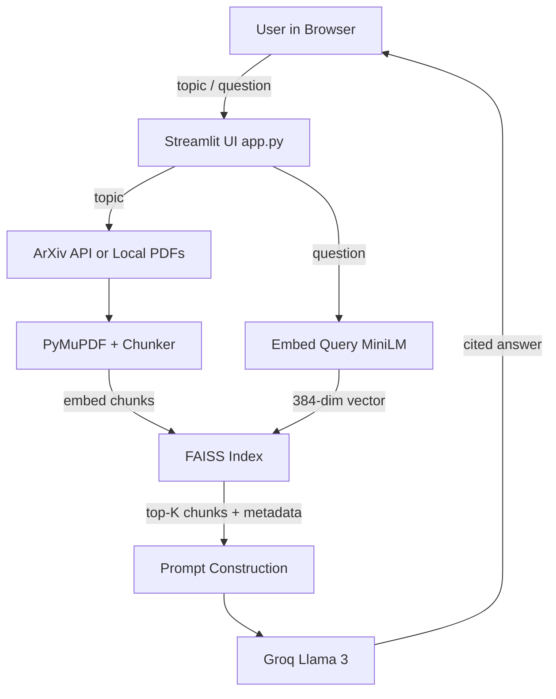

# 📚 ArXiv Research Assistant

A Retrieval-Augmented Generation (RAG) system that answers questions about research papers with inline citations.

**🔗 Live Demo:** [https://jatin-rag-arxiv.streamlit.app](https://jatin-rag-arxiv.streamlit.app)
**📂 Repo:** [github.com/Jtgoyal/rag-arxiv-assistant](https://github.com/Jtgoyal/rag-arxiv-assistant)

---

## What it does

Ask a question in plain English about a set of research papers. The system retrieves the most relevant passages using semantic search, then generates a grounded answer with numbered citations pointing back to the source papers — so every claim is verifiable.

**Example:**
> **Q:** What problems does RAG solve?
>
> **A:** RAG solves the following problems:
> 1. **Hallucination:** RAG models hallucinate less and generate factually correct text more often than BART [3].
> 2. **Lack of diversity:** RAG generations are more diverse than BART generations [3].
> 3. **Limited knowledge:** RAG can use parametric knowledge to generate reasonable responses when questions cannot be answered from external sources alone [4].
>
> **Sources:**
> [1] rag_paper — distance 1.121
> [2] rag_paper — distance 1.196
> [3] rag_paper — distance 1.270
> ...

---

## Why this project

Researchers face an information-overload problem: ArXiv adds ~500 new ML papers per day. No human can keep up. Existing search tools (Google, ArXiv's own search) only find papers — they don't read them. This tool lets you **chat with the literature**: ask questions, get cited answers, decide which paper to read in full.

---

## Tech Stack

| Layer | Tool | Why |
|---|---|---|
| Orchestration | LangChain | Standard interface across LLM providers |
| Embeddings | sentence-transformers (`all-MiniLM-L6-v2`) | Free, local, 384-dim, ~80MB |
| Vector Store | FAISS (IndexFlatL2) | Free, fast C++ similarity search |
| LLM | Llama 3 8B via Groq | Free tier, fast inference, sufficient for grounded RAG |
| Paper Source | ArXiv API (`arxiv` Python package) | Free, no auth, authoritative |
| PDF Parsing | PyMuPDF | Handles complex academic layouts |
| UI | Streamlit | Pure-Python web UI, ML-community standard |
| Deployment | Streamlit Cloud | Free hosting from GitHub |

---

## Architecture



## Key Engineering Decisions

### Chunk size: 1000 chars with 200-char overlap
- **Smaller (300):** precise but loses paragraph context
- **Larger (2000):** more context but noisy retrieval
- **Sweet spot at 1000** for academic papers (~1–2 paragraphs per chunk)
- **20% overlap** prevents concepts being severed at chunk boundaries — verified by inspection on the RAG paper

### Two-source ingestion (Local + ArXiv)
- ArXiv API can rate-limit and fail transiently
- Local mode (load from a folder) is the reliable demo path
- Same chunk-dict format from both → rest of the pipeline is decoupled from data source

### Two-layer hallucination guard

**Layer 1 (Distance threshold):** Before calling the LLM, check the top retrieval distance. If `> 1.5`, refuse immediately — saves cost/latency on obviously off-topic queries. The UI shows a red error with the actual distance value.

**Layer 2 (LLM-judged refusal):** For queries that pass Layer 1, the LLM is instructed to refuse if context is insufficient. The UI shows a yellow warning, distinguishing it from the red Layer 1 case.

**Why two layers:** Distance and content relevance are correlated but not identical signals. My testing showed two queries with similar distances correctly producing opposite behaviors — the LLM reading actual chunk text is a smarter judge than a threshold, but the threshold catches obvious garbage cheaply. Belt and suspenders.

**Citation validation:** Inline `[N]` references are regex-extracted and validated against retrieved chunks. Invalid citations (e.g., LLM hallucinating `[8]` when only 5 chunks exist) are silently dropped. Across 20 eval questions, the validator caught 132 hallucinated citations.

### Defensive ArXiv downloads
- Retries on HTTP 429 with exponential backoff (10s, 20s, 30s)
- Retries on incomplete-read errors (transient network drops)
- Corrupt-cache detection: PDFs < 50KB on disk are treated as half-downloads and re-fetched

---

## Evaluation

Built a 20-question evaluation set covering three categories:
- **Direct factual** (11 questions) — single-paper retrieval
- **Comparison** (4 questions) — multi-paper synthesis
- **Out-of-scope** (5 questions) — should be refused

### Results

| Metric | Score | Notes |
|---|---|---|
| Retrieval accuracy (top-5) | **95%** (19/20) | Expected paper in top-5 retrieved |
| Refusal correctness | **85%** (17/20) | OOS refused, in-scope answered |
| Out-of-scope refusal rate | **80%** (4/5) | Two-layer guard performance |
| Citation hallucinations caught | **132 invalid `[N]` refs dropped** | Validator caught LLM-fabricated references |
| Keyword recall (answered) | 53% | Strict matching — many "failures" are correct paraphrases (see failure_analysis.md) |

### Failure modes (3 of 20)

Documented in `evaluation/failure_analysis.md`:

- **Q11 / Q20** — Over-refusal on compound or math-explanation questions. Fix: multi-query retrieval.
- **Q16** — Hallucination slip-through on ML-adjacent OOS query. Fix: tighter L2 prompt or reranker.

The 3 failures reveal a precision/recall tension between Layer 1 and Layer 2 guards. Current calibration prioritizes refusal over hallucination — appropriate for a research assistant.

To reproduce: `python evaluation/run_eval.py`

---

## Setup

```bash
# 1. Clone
git clone https://github.com/Jtgoyal/rag-arxiv-assistant.git
cd rag-arxiv-assistant

# 2. Create venv and install deps
python -m venv venv
source venv/Scripts/activate    # Windows Git Bash
# OR: source venv/bin/activate  # Mac/Linux
pip install -r requirements.txt

# 3. Set API key
cp .env.example .env
# Edit .env and paste your Groq API key from https://console.groq.com

# 4. (Optional) Add local PDFs for offline mode
mkdir local_papers
# Drop 2-3 ArXiv PDFs into local_papers/

# 5. Run
streamlit run app.py
```

---

## Project Structure
```
rag-arxiv-assistant/
├── app.py                       # Streamlit UI
├── rag_pipeline.py              # PaperIndex class + generation + two-layer guard + citation validator
├── paper_pipeline.py            # Combines fetch + chunk; local + ArXiv modes
├── fetch_arxiv.py               # ArXiv API + robust PDF download
├── pdf_to_chunks.py             # PyMuPDF + RecursiveCharacterTextSplitter
├── sample_papers/               # Pre-loaded PDFs for the deployed demo
├── evaluation/
│   ├── eval_set.py              # 20-question manual evaluation set
│   ├── run_eval.py              # Eval runner with retrieval/refusal/keyword metrics
│   ├── results.json             # Latest eval results
│   └── failure_analysis.md      # Documented failure modes + planned fixes
├── experiment_embeddings.py     # Day 2 standalone embedding playground
├── experiment_faiss.py          # Day 2 standalone FAISS playground
├── hello_groq.py                # Day 1 hello-world LLM call
├── requirements.txt
├── NOTES.md                     # Engineering log (daily learnings + bug stories)
├── .env.example                 # Template for API key
└── README.md
``` 

---

## Roadmap

- [x] Day 1: Environment + first LLM call
- [x] Day 2: Embeddings + FAISS basics
- [x] Day 3: PDF chunking
- [x] Day 4: ArXiv API integration
- [x] Day 5: End-to-end RAG pipeline (CLI)
- [x] Day 6: Streamlit UI with refusal banner
- [x] Day 7: README + repo polish
- [x] Day 8: Citation polish + validation
- [x] Day 9: Two-layer hallucination guard
- [x] Day 10: Deploy to Streamlit Cloud
- [x] Day 11: Evaluation set + metrics
- [ ] Day 12: Edge cases + error handling
- [ ] Day 13: Demo GIF
- [ ] Day 14: Resume + interview prep

---

## Author

Jatin Goyal — Integrated M.Tech in Mathematics and Computing, IIT (ISM) Dhanbad. Building this project to deepen understanding of production RAG systems for AI/ML internship applications.

[LinkedIn](https://linkedin.com/in/jatin-goyal-142880294) · [GitHub](https://github.com/Jtgoyal)
